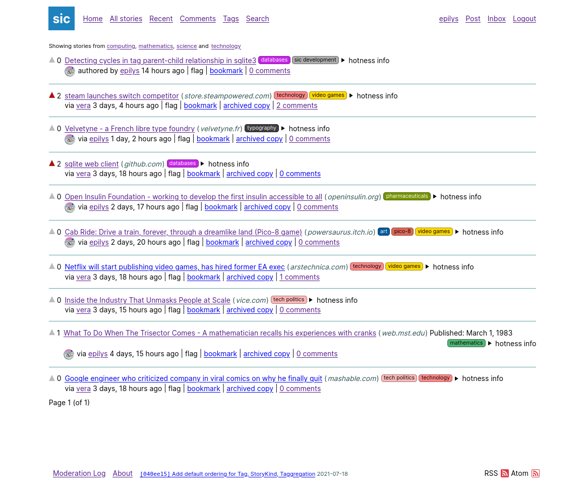
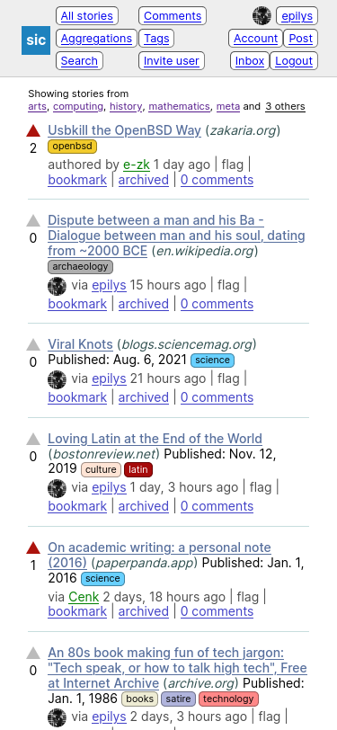

# [[sic]](https://sic.pm) link aggregator organised by tags [<kbd><b>AGPL-3.0</b></kbd>](https://github.com/epilys/sic/blob/main/LICENSE) [<kbd><b>`python3`</b></kbd>](https://www.python.org/) [<kbd><b>`django3`</b></kbd>](https://www.djangoproject.com/) [<kbd><b>`sqlite3`</b></kbd>](https://sqlite.org)

Public instance at https://sic.pm | [Tor hidden service](http://sicpm3hp7dtrwhmf4qlelycqlvie6flqa5qnjnt3snok5xydvxhs4xyd.onion/) | IRC: [`#sic` on Libera Chat](https://libera.chat/) | [[sic] bot on Mastodon](https://botsin.space/@sic)

<table align="center">
	<tbody>
		<tr>
			<td><kbd></kbd></td>
			<td><kbd></kbd></td>
		</tr>
	</tbody>
</table>

## In a nutshell

- No Javascript necessary. An HTML5 compliant browser is enough; it even runs on [`w3m`, the text web browser](http://w3m.sourceforge.net/).
- Lightweight, requires only a `python3` environment and stores its database in a `sqlite3` file.
- Can be deployed with WSGI compatible servers (Apache/NGINX) or even `django`'s development server if need be.

### ✒️ Forum features

- Posts can be text and/or URLs.
- Posts can optionally have any number of tags.
- Latest stories RSS and Atom feeds are provided.
- Post and comment text content support [commonmark Markdown syntax](https://commonmark.org/).
- Posts and comments can only be upvoted. Support for flagging (downvoting) will be added soon.
- Posts can be pinned to the top with a time limit or indefinitely.

### 🏷️ Tag and 🗂️ Aggregation system

- Tags can optionally have any number of parent tags (but cycles are not allowed)
- Tags can optionally be organised in _Aggregations_, which are collections of tags with a common theme. A user's frontpage can be either all stories or their subscribed aggregations' stories.
- Aggregations can optionally be private, public or discoverable by other users.
- Aggregations can be set as "default" by moderators. New users are subscribed to default aggregations.
- Users can create their own aggregations at any time.
- Tags, users and domains can be excluded from an Aggregation via _exclude filters_.

### 🔍 Search system

- Comments and posts are automatically indexed in a separate `sqlite` database file using the `fts5` (full text search) virtual table extension.
- Posts with URLs can optionally have their remote content fetched and indexed with a `django` management command (e.g. from within a cron job).

### 🎛️ Permission and moderation system

- Users can be inactive, active or banned.
- Moderators can set the number of days for which an account is considered new. New accounts cannot add tags or perform other potentially destructive actions.
- Public moderation log.

### 📨 Notification and email system

- Mentioning other users in comments notifies them.
- Users can choose when they receive each kind of notification via email
- Users can optionally enable a weekly digest email.

### 👥 Account system

- Users can either freely sign-up or have to be invited to.
- Users can optionally request for an invitation (this feature can be turned off).
- Users can save any story, comment to their bookmarks along with personal notes and export them at any time.
- Users can add personal metadata in their profile, including an avatar.
- Users can add "hats" to their account, which are decorations that can optionally be added to a comment. For example a moderator user wanting to comment as a moderator and not as a user would use a hat.
- Users have a personalised Atom or RSS feed that shows only their subscriptions.

### 🌐 Web standards

- Posted URLs are notified with [`webmention`](https://www.w3.org/TR/webmention/).
- Users can be retrieved with [`webfinger`](https://webfinger.net/).


## Setup / Deployment

```shell
cp sic/local/secret_settings.py{.template,}
vim sic/local/secret_settings.py # REQUIRED: add secret token
vim sic/local/settings_local.py # OPTIONAL: local settings (SMTP etc)
python3 -m venv # OPTIONAL: setup virtual python enviroment in 'venv' directory
python3 -m pip install -r requirements.txt # Or 'pip3' install...
python3 manage.py migrate #sets up database
python3 manage.py createsuperuser #selfexplanatory
python3 manage.py runserver # run at 127.0.0.1:8000
python3 manage.py runserver 8001 # or run at 127.0.0.1:8001
python3 manage.py runserver 0.0.0.0:8000 # or run at public-ip:8000
```

See [`DEPLOY.md`](DEPLOY.md) for deployment instructions.

## Code style

See [`CODE_STYLE.md`](CODE_STYLE.md).
